# H-DV_IA-2

This Repo contains the Global trade analysis of Countries Australia, USA and Canada over the years 1988-2016 and for 12 different category done by me in my BTech Semester-3
  
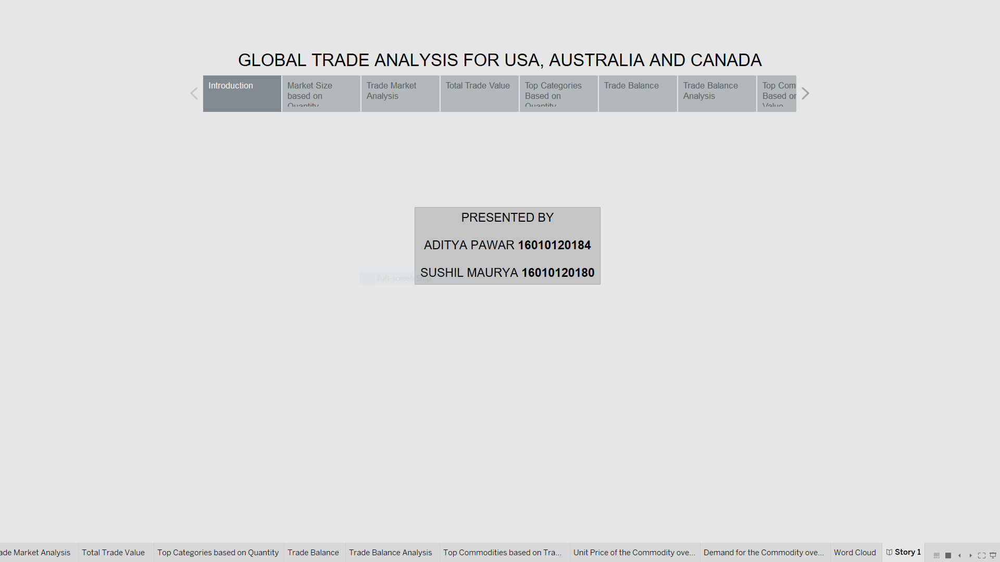
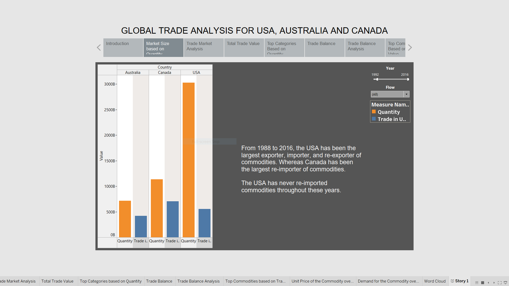
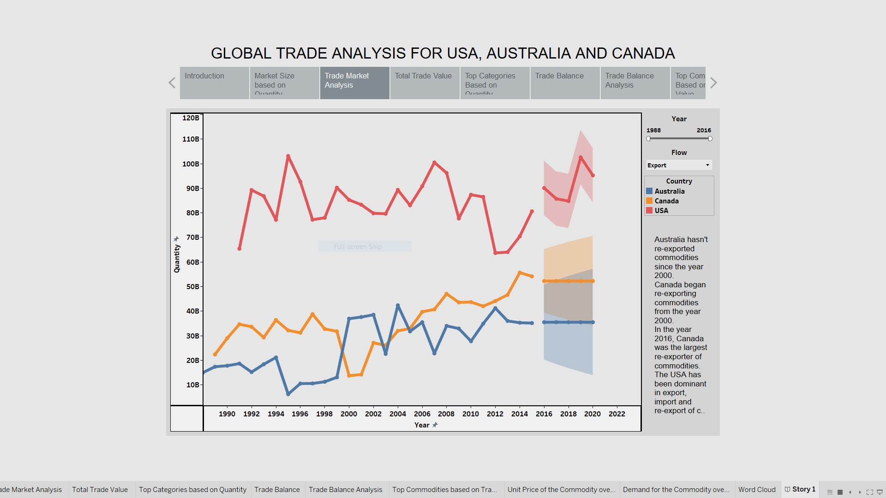

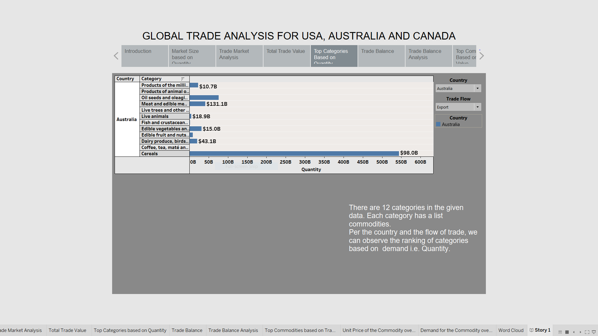
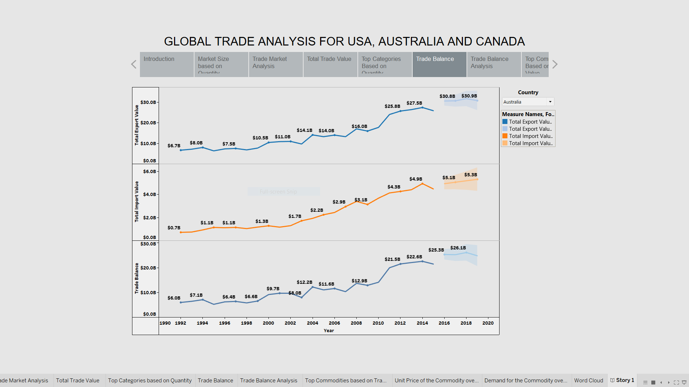
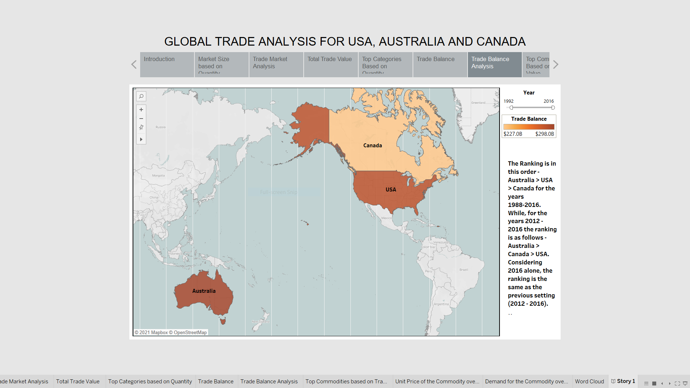
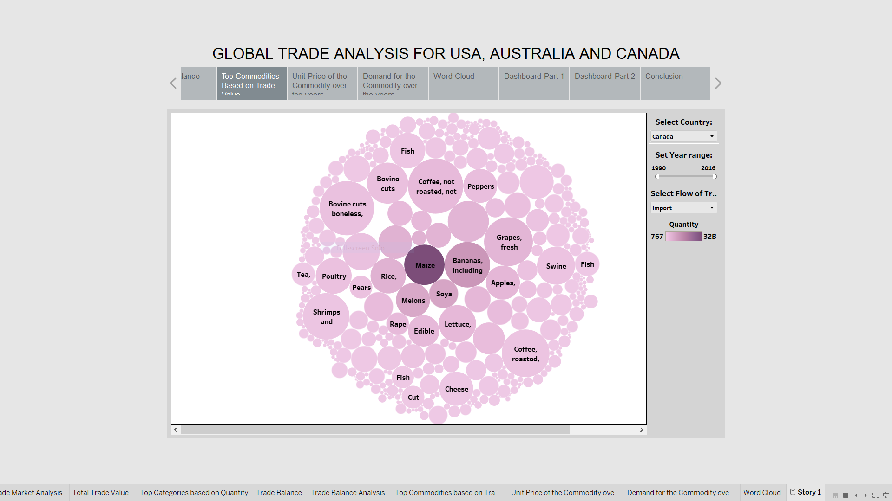
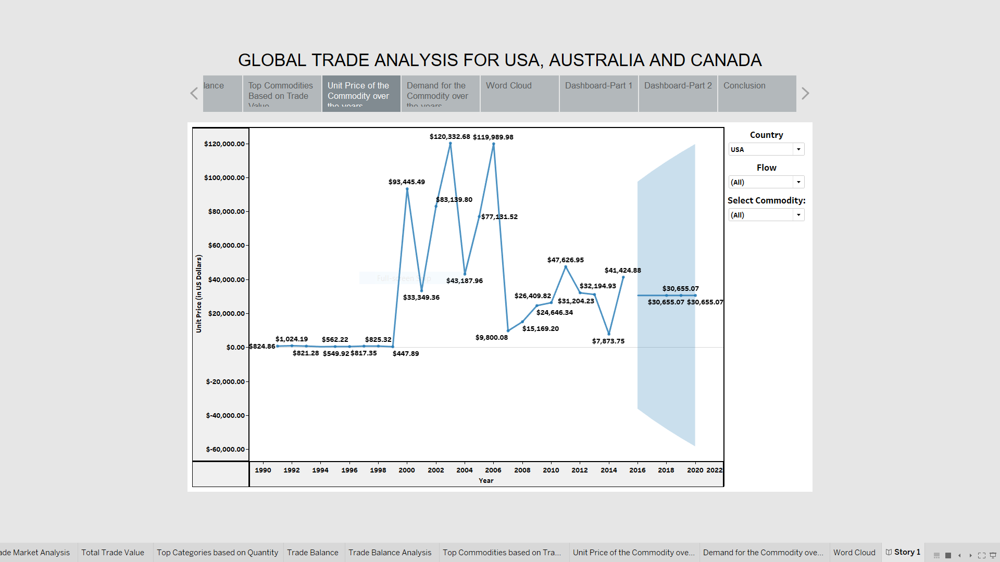
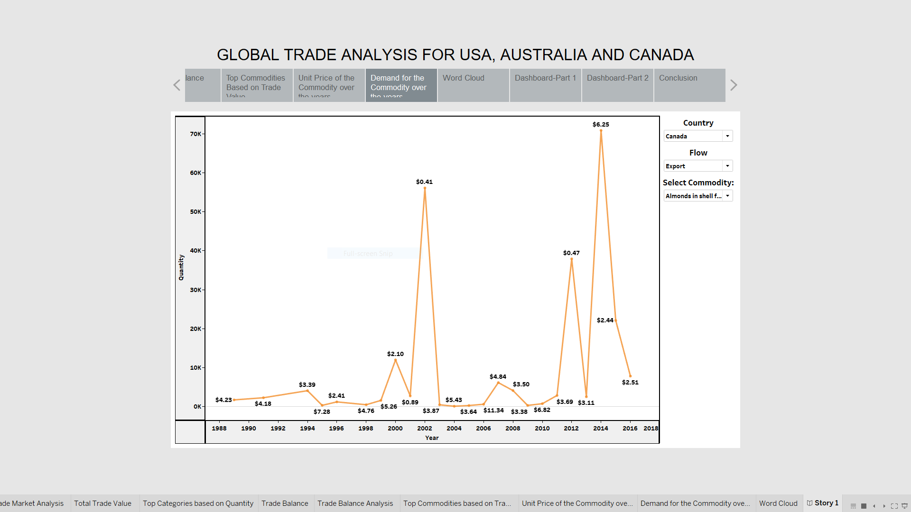
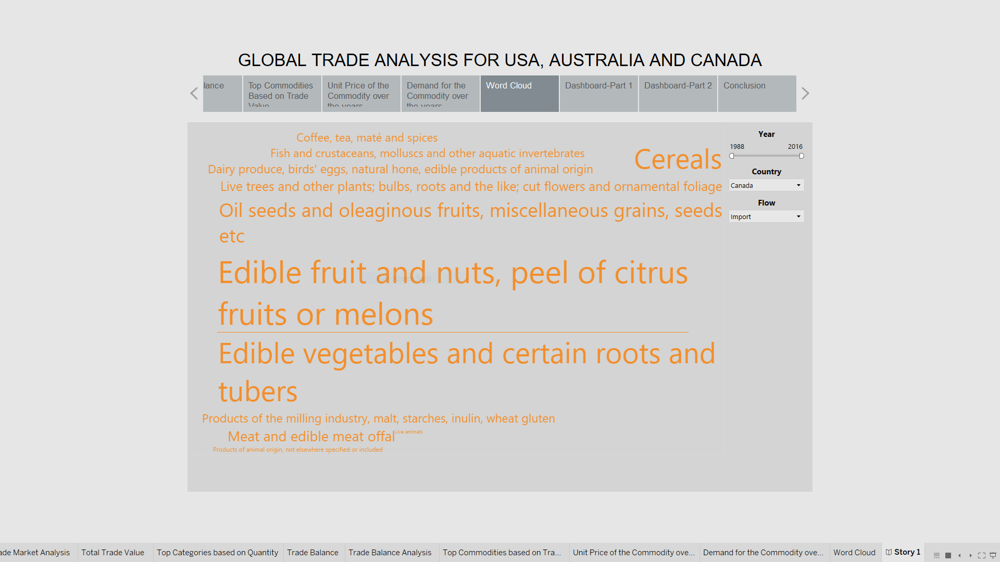
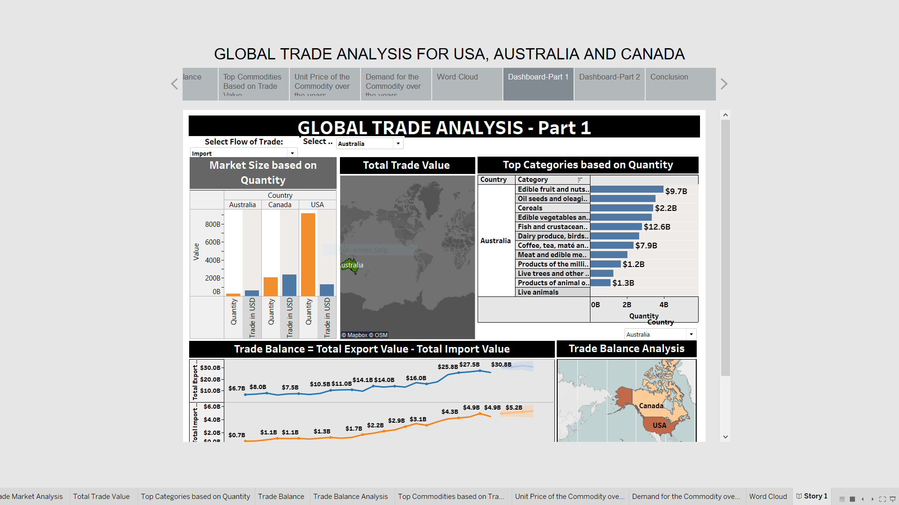
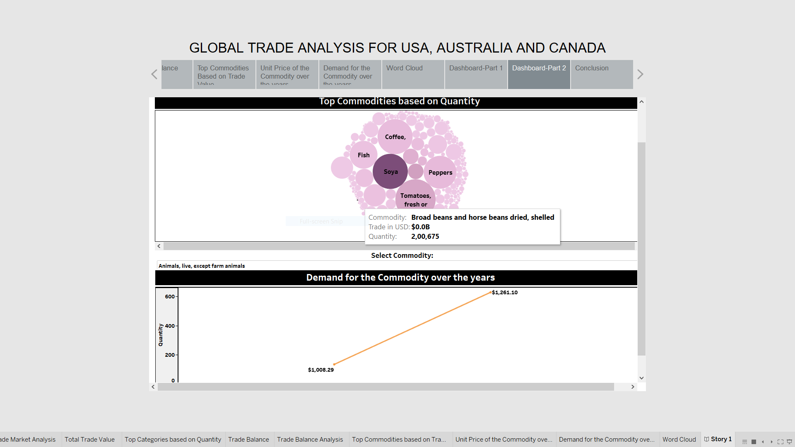
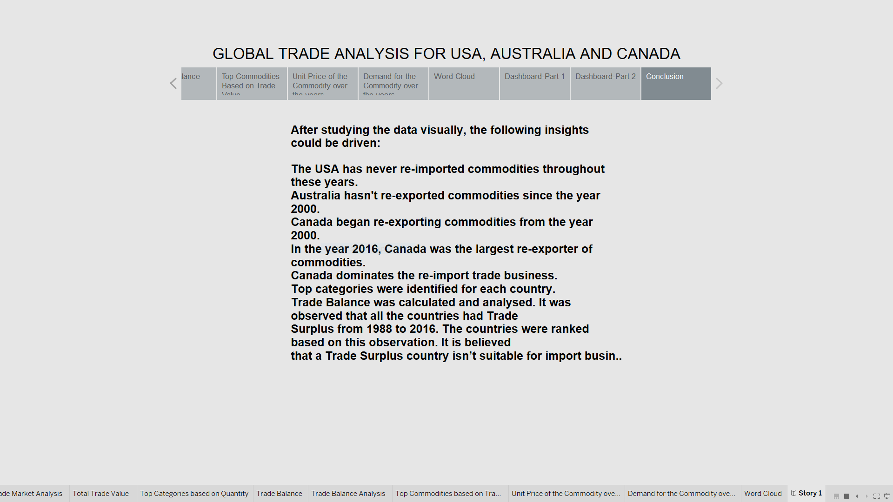

### Contributers 
#### Aditya Pawar - 16010120184 
#### Sushil Maurya - 16010120180

### Acknowledgement
#### We would like to thank Prof. Vaibhav Vasani and Archana Sharma mam for their guidance and support

